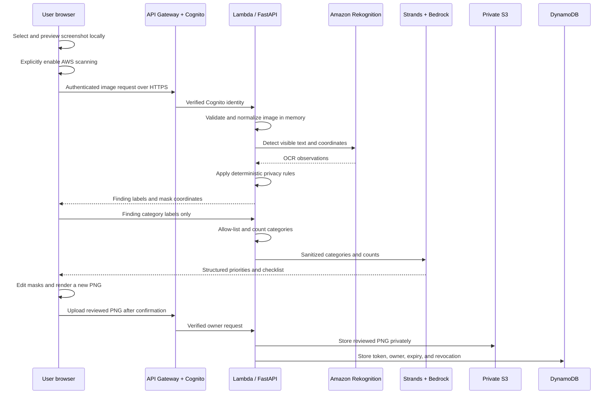
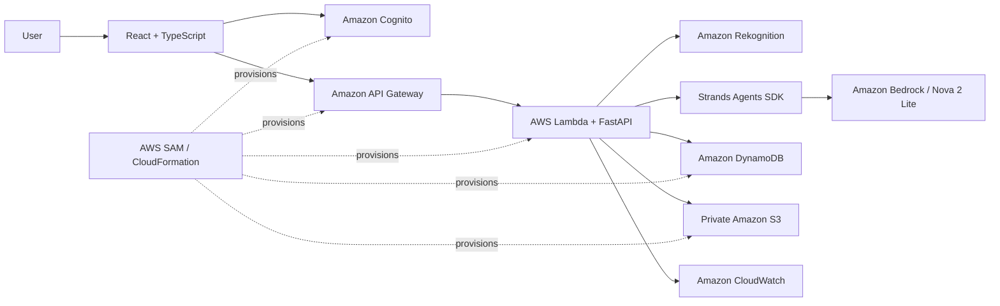

<div align="center">

# DemoSafe

**Share the work. Keep the secrets.**

Built by **Team VisionX** for **Bharat Builds: First Commit** — a WeMakeDevs × AWS hackathon.

A human-controlled privacy release gate for screenshots, built with AWS serverless services, Amazon Rekognition, Strands Agents, and Amazon Bedrock.

[](https://aws.amazon.com/)
[](https://www.wemakedevs.org/aws)
[](frontend/)
[](backend/)
[](backend/tests/)
[](LICENSE)

</div>

---

## Table of contents

- [Executive summary](#executive-summary)
- [Problem statement](#problem-statement)
- [Why DemoSafe](#why-demosafe)
- [Why users can trust DemoSafe](#why-users-can-trust-demosafe)
- [Supported screenshot scope](#supported-screenshot-scope)
- [How it works](#how-it-works)
- [Privacy architecture](#privacy-architecture)
- [How the AI agent works](#how-the-ai-agent-works)
- [Core features](#core-features)
- [Demo scenario](#demo-scenario)
- [Before and after](#before-and-after)
- [AWS architecture](#aws-architecture)
- [Responsible AI and privacy](#responsible-ai-and-privacy)
- [Technical innovation](#technical-innovation)
- [Hackathon criteria](#hackathon-criteria)
- [Challenges and lessons](#challenges-and-lessons)
- [Validation and current status](#validation-and-current-status)
- [Known limitations](#known-limitations)
- [Repository structure](#repository-structure)
- [Getting started](#getting-started)
- [AWS deployment](#aws-deployment)
- [Demo instructions](#demo-instructions)
- [Competitive position](#competitive-position)
- [Future scope](#future-scope)
- [Documentation](#documentation)

---

## Live deployment

DemoSafe is publicly deployed on AWS Amplify in the Mumbai region.

| Resource | Public link | Purpose |
| --- | --- | --- |
| DemoSafe web application | [Open DemoSafe](https://production.dx2z6eik8hnh4.amplifyapp.com) | The public React application for sign-in, screenshot review, redaction, and controlled sharing. |
| API health check | [Open API health](https://a8aznijuq0.execute-api.ap-south-1.amazonaws.com/api/health) | Runtime proof that the AWS API is responding and identifies the active scanner and review agent. |

The hosted frontend is served by **AWS Amplify**. Its requests go through **API Gateway** to **AWS Lambda**. Cognito handles identity, Rekognition handles OCR, Bedrock powers the Strands review agent, and S3 with DynamoDB supports private, expiring shares.

> The API root is intentionally not a webpage. For deployment proof, open the API health link above, which returns JSON.

## Executive summary

DemoSafe helps developers, support teams, students, educators, founders, and creators avoid accidental data exposure when sharing screenshots. It uses Amazon Rekognition to locate visible text, conservative rules to identify supported sensitive patterns, and a privacy-bounded Strands agent with Amazon Bedrock to produce a short review checklist.

The product keeps a human in control. Users can accept, remove, resize, or add masks before DemoSafe renders a new flattened PNG in which the selected pixels are permanently replaced. The reviewed image can be downloaded or published through a link that expires after one hour, one day, or seven days and can be revoked early by its owner.

## Problem statement

Screenshots shared in bug reports, tutorials, support chats, documentation, and social posts can accidentally expose:

- API keys, tokens, and labelled credentials
- AWS account IDs, ARNs, instance IDs, and security-group IDs
- Public IP addresses and internal infrastructure details
- Email addresses and phone numbers
- Customer information, browser tabs, and notifications

Manual editors work only when the sender notices every risky detail. Fully automatic tools can destroy useful context through false positives or create false confidence through false negatives.

> **Build a privacy release gate that assists the user in finding likely exposure, preserves human judgment, permanently redacts approved regions, and shares only the reviewed copy through an expiring, revocable link.**

## Why DemoSafe

DemoSafe combines controls that are often split across separate OCR, image-editing, and file-sharing products:

1. **AWS-assisted discovery** reduces the chance of overlooking common textual exposure.
2. **Privacy-bounded agent review** explains which detected categories deserve attention without receiving screenshot pixels or detected values.
3. **Human verification** lets the sender correct suggestions and cover visual content automation missed.
4. **Permanent redaction** replaces pixels in a newly rendered PNG instead of adding a removable HTML overlay.
5. **Controlled sharing** gives the owner expiry and revocation controls.
6. **Graceful fallback** keeps manual redaction usable when OCR or the agent is unavailable.

DemoSafe does not claim that AI makes an image safe. It makes the review step faster, more visible, and more deliberate.

## Why users can trust DemoSafe

Privacy products should not ask users for blind trust. DemoSafe reduces the amount of trust required through inspectable technical controls:

- **Explicit cloud consent:** selecting a file does not automatically send it to OCR. The user must enable AWS scanning and start the scan.
- **No original-image publishing:** the original uploaded screenshot is used for the requested scan but is not written to the share bucket. Only the newly rendered, reviewed PNG can be published.
- **Minimized AI input:** Bedrock receives finding categories and counts, not screenshot pixels, OCR text, detected values, filenames, or share links.
- **Local final rendering:** the browser creates the flattened PNG. Selected regions become output pixels rather than removable interface overlays.
- **Private storage:** the S3 bucket blocks public access, requires encrypted transport, and encrypts stored objects.
- **Verified identity:** API Gateway validates Cognito JWTs, and ownership comes from verified token claims rather than a client-provided user ID.
- **Limited sharing:** links have a selected expiry and can be revoked early.
- **Transparent source and infrastructure:** the detection rules, agent boundary, API routes, IAM permissions, and SAM template are available for review.
- **Honest uncertainty:** the interface states that OCR and rules can miss items and requires a human decision before sharing.

This is not a zero-trust or fully local product. When the user chooses **Scan with AWS**, the selected image is transmitted over HTTPS to the DemoSafe API in AWS and processed by Lambda and Amazon Rekognition. Teams that cannot permit cloud image processing should use manual masks or a future local-OCR mode. Anyone who obtains an active share URL can view its reviewed image until the link expires or is revoked, and DemoSafe cannot recall a copy already downloaded by a recipient.

## Supported screenshot scope

DemoSafe is not limited to terminal screenshots. It accepts a single-frame PNG or JPEG up to 3 MB, under 6 megapixels, and no more than 4096 pixels on either side.

The current automatic detection is best suited to text-heavy screenshots such as:

- Terminals, shell output, logs, and stack traces
- AWS or other cloud-console pages
- Deployment dashboards and monitoring screens
- Configuration, environment-variable, and code-editor views
- Error messages and support tickets
- Admin panels and account pages
- Documentation and technical tutorials
- Customer-support screenshots containing visible contact details

Manual masks can be drawn on any supported screenshot, but automatic detection is currently weaker for:

- Faces and profile photographs
- QR codes and barcodes
- Handwriting
- Browser tabs, icons, notifications, and other non-text graphics
- Low-resolution, heavily compressed, rotated, or partially obscured text
- Unsupported languages or organization-specific identifiers
- Video recordings and animated images

These limits are why the Strands checklist prompts the user to inspect visual areas that OCR may miss.

## How it works

```text
Upload screenshot
      ↓
Explicit consent to AWS scan
      ↓
Amazon Rekognition OCR + bounding boxes
      ↓
Deterministic privacy-pattern detection
      ↓
Optional Strands + Bedrock review of sanitized categories
      ↓
Human accepts, adjusts, removes, or adds masks
      ↓
New flattened PNG is rendered
      ↓
Download or create an expiring, revocable share link
```

The original uploaded screenshot is not placed in the sharing bucket. Only the newly rendered, reviewed PNG is eligible for publishing.

## Privacy architecture

DemoSafe separates image processing, AI reasoning, and sharing so each component receives only what it needs.



### Data handled at each stage

| Stage               | Receives                                               | Does not receive or retain through this stage                                           |
| ------------------- | ------------------------------------------------------ | --------------------------------------------------------------------------------------- |
| Browser editor      | Original screenshot and masks                          | Does not upload merely because a file was selected                                      |
| Rekognition scan    | User-approved normalized image                         | DemoSafe does not persist the original in S3 or DynamoDB                                |
| Deterministic rules | OCR text and coordinates inside Lambda memory          | Raw matched values are not returned to the frontend                                     |
| Strands and Bedrock | Allow-listed category names and counts                 | No screenshot, OCR text, detected values, filename, link, or user identity              |
| Share storage       | Final normalized flattened PNG                         | Original screenshot is not eligible for sharing storage                                 |
| DynamoDB            | Owner ID, token, timestamps, expiry, and revoked state | No screenshot pixels or detected secret values                                          |
| CloudWatch          | Lambda runtime and generic errors                      | Application code avoids logging screenshots, OCR output, and provider exception details |

## How the AI agent works

Yes. DemoSafe uses the open-source **Strands Agents SDK** with **Amazon Bedrock** and the **Amazon Nova 2 Lite** foundation model.

The agent is an explanation and review agent, not the detector:

1. Rekognition finds visible text and coordinates.
2. Deterministic rules identify supported sensitive categories and their mask positions.
3. The backend rejects unknown labels, removes duplicate values, and converts findings into category counts, such as `Email address: 2`.
4. Strands loads the `privacy-review` Agent Skill, which defines the privacy boundary and review behavior.
5. Bedrock receives only those sanitized categories and counts.
6. Strands validates the response against a structured schema: overall risk, present categories, severity, recommended review action, and a visual checklist.
7. The user decides whether to keep, change, or remove each mask.

The agent has no tools that can read S3, query DynamoDB, inspect the screenshot, publish a share, revoke a link, or change a mask. If Bedrock is unavailable, the Rekognition suggestions and manual editor continue to work.

```text
Screenshot → Rekognition → deterministic rules → category counts
                                                    ↓
                                      Strands Agent Skill
                                                    ↓
                                      Amazon Bedrock / Nova
                                                    ↓
                                    priorities + checklist
                                                    ↓
                                         human decision
```

## Core features

- Amazon Rekognition OCR with bounding-box suggestions
- Detection for supported AWS identifiers, IP addresses, emails, Indian phone numbers, credentials, and token formats
- Strands privacy-review skill powered by Amazon Bedrock
- Sanitized agent input containing categories and counts only
- Structured risk summary, priority actions, and visual-review checklist
- Adjustable suggestions and manual masks
- Flattened PNG export
- Cognito registration and authenticated private workspace
- Private S3 storage for published redacted images
- DynamoDB ownership, expiry, and revocation state
- One-hour, 24-hour, and seven-day share expiry
- Immediate owner-controlled revocation
- AWS system-status view
- Manual workflow when automated services are unavailable

## Demo scenario

Prachi is preparing a technical post about an AWS deployment. Her fictional terminal screenshot contains an account ID, EC2 instance ID, IP address, email address, and API token.

She uploads it to DemoSafe and consents to AWS scanning. Rekognition returns text locations, deterministic rules suggest masks, and the Strands agent prioritizes the finding categories without receiving the screenshot or secret values. Prachi adjusts one suggestion and manually covers a detail OCR missed. She exports the flattened PNG, creates a 24-hour link, and later revokes it from **My shares**.

## Before and after

| Stage         | Before                                                                            | After                                                      |
| ------------- | --------------------------------------------------------------------------------- | ---------------------------------------------------------- |
| Image content | Infrastructure identifiers, contact details, and a fictional token remain visible | Selected pixels are replaced in a new PNG                  |
| User control  | The sender must notice every issue alone                                          | Suggestions are editable and manual masks remain available |
| Sharing       | A normal image can persist indefinitely after posting                             | The DemoSafe link has an expiry and can be revoked         |
| AI access     | An unrestricted model could receive raw screenshot content                        | The agent receives only allow-listed categories and counts |

Add final project screenshots here before submission:

| Original fictional screenshot | Reviewed flattened result |
| ----------------------------- | ------------------------- |
| `[ADD BEFORE IMAGE]`          | `[ADD AFTER IMAGE]`       |

## AWS architecture



| AWS service              | Purpose in DemoSafe                                              |
| ------------------------ | ---------------------------------------------------------------- |
| Amazon Cognito           | Registration, sign-in, and access tokens for private operations  |
| Amazon API Gateway       | Public API URL, routing, JWT authorization, CORS, and throttling |
| AWS Lambda               | Serverless FastAPI backend                                       |
| Amazon Rekognition       | Text detection and screenshot coordinates                        |
| Amazon Bedrock           | Amazon Nova structured privacy review                            |
| Amazon S3                | Private storage for normalized reviewed PNGs                     |
| Amazon DynamoDB          | Ownership, expiry, and revocation records                        |
| Amazon CloudWatch        | Lambda runtime logs                                              |
| AWS SAM / CloudFormation | Reproducible infrastructure and deployment                       |
| AWS Amplify Hosting      | Planned public frontend hosting for the final Ship It URL        |

The detailed technology inventory is in [docs/TECH_STACK.md](docs/TECH_STACK.md).

## Responsible AI and privacy

- The user must explicitly opt in before a screenshot is sent to AWS OCR.
- Deterministic rules identify supported categories before the agent is called.
- The Strands agent receives categories and counts, never the screenshot, OCR text, detected values, filename, share link, or account identity.
- The agent cannot publish, export, delete, or revoke anything.
- Structured output is validated against a bounded schema.
- Every suggested mask remains editable.
- The interface communicates that OCR and detection can miss content.
- Final review is mandatory before publishing.
- If Bedrock fails, deterministic suggestions and manual masks remain available.

## Technical innovation

### Privacy-bounded agent

The agent is useful because it prioritizes risk and supplies a visual checklist, but its input is deliberately minimized. The `privacy-review` Agent Skill defines what the agent may consider and forbids requests for raw image content or secret values.

### Hybrid detection

Rekognition supplies OCR text locations while deterministic rules decide which supported patterns are sensitive. This makes mask coordinates reproducible and limits the model to explanation rather than unconstrained image decisions.

### Release gate instead of one-click automation

DemoSafe treats redaction as a release decision. Detection, editing, flattened export, expiry, and revocation form one controlled workflow.

### Serverless evidence

The application exposes a public health route and a presentation-ready AWS status view. CloudFormation state and CloudWatch logs provide separate deployment and runtime evidence.

## Hackathon criteria

| Criterion       | DemoSafe evidence                                                                                                      |
| --------------- | ---------------------------------------------------------------------------------------------------------------------- |
| Idea and impact | Addresses accidental screenshot exposure with a narrow, understandable release workflow                                |
| Built on AWS    | Uses Cognito, API Gateway, Lambda, Rekognition, Bedrock, S3, DynamoDB, CloudWatch, SAM, and CloudFormation             |
| Learning        | Documents real deployment challenges, service constraints, privacy boundaries, and the resulting engineering decisions |
| Execution       | Implements the complete upload, scan, review, redact, export, share, expiry, and revoke path                           |
| Demo video      | Provides a timed three-minute script showing the user problem, working feature, AWS role, evidence, and learning       |

## Challenges and lessons

| Challenge                        | What happened                                                              | Resolution and lesson                                                                                |
| -------------------------------- | -------------------------------------------------------------------------- | ---------------------------------------------------------------------------------------------------- |
| OCR service availability         | Textract was unavailable for the selected student-account setup            | Rekognition DetectText was integrated and verified instead of presenting an untested service         |
| Lambda concurrency quota         | Reserved concurrency caused CloudFormation rollback in the student account | The function uses the account's unreserved pool while API Gateway throttles bursts                   |
| Protected preflight requests     | Cognito authorization initially interfered with browser CORS preflight     | Explicit unauthenticated OPTIONS handling was added                                                  |
| GitHub Actions Python cache      | The workflow failed when a pip cache directory did not yet exist           | CI setup was corrected so validation could complete reliably                                         |
| AI privacy boundary              | Sending OCR text to a model would expose the very values being protected   | Only allow-listed categories and counts are passed to Strands/Bedrock                                |
| Redaction certainty              | OCR can miss items and rules can produce false positives                   | Manual masks, editable suggestions, and explicit user confirmation remain mandatory                  |
| Cloud proof versus configuration | A healthy API does not prove every downstream service invocation           | The demo combines health output, working scan/agent results, CloudFormation, and CloudWatch evidence |

## Validation and current status

### Verified

- AWS backend deployed in `ap-south-1`
- Public health endpoint returns deployed mode, region, Rekognition, and Strands/Bedrock configuration
- Frontend production build passes
- 26 backend tests pass
- Cognito, API Gateway, Lambda, S3, DynamoDB, and CloudWatch are provisioned by the SAM stack
- Manual redaction, export, controlled sharing, share listing, and revocation are implemented

Run all local checks:

```bash
npm run check
```

Check the deployed backend:

```bash
curl -s https://a8aznijuq0.execute-api.ap-south-1.amazonaws.com/api/health \
  | python3 -m json.tool
```

### Still required before final submission

- Deploy the React frontend to a public HTTPS URL
- Update the SAM `FrontendOrigin` parameter to that exact origin
- Test the full flow from the public URL
- Add before/after screenshots, team roles, video URL, and final Actions run

## Known limitations

- OCR and pattern rules can miss sensitive text or produce false positives.
- The Strands agent prioritizes known finding categories; it does not inspect the screenshot or generate new mask coordinates.
- Manual review remains necessary for faces, QR codes, notifications, browser tabs, and non-text graphics.
- Revocation prevents future access through DemoSafe but cannot recall a copy that a recipient already downloaded.
- The current product processes still screenshots rather than complete recordings or video frames.
- Detection covers a defined set of developer and personal-data patterns rather than organization-specific policies.
- The serverless health response confirms configuration and backend reachability, not the success of every downstream AWS call.
- A public Amplify frontend URL is still required for the final Ship It submission.

## Repository structure

```text
demo-safe/
├── .github/workflows/       GitHub Actions validation
├── backend/
│   ├── app/
│   │   ├── main.py          FastAPI routes and Lambda handler
│   │   ├── detection.py     OCR conversion and privacy patterns
│   │   ├── storage.py       Local and AWS storage implementations
│   │   └── agent_review.py  Strands + Bedrock structured review
│   ├── skills/
│   │   └── privacy-review/  Agent Skill and privacy constraints
│   └── tests/               Backend test suite
├── frontend/
│   ├── src/main.tsx         Editor, shares, agent, and AWS status UI
│   ├── src/AuthGate.tsx     Cognito authentication surface
│   ├── src/api.ts           Authenticated API client
│   └── src/image.ts         Mask rendering and PNG export
├── infra/template.yaml      AWS SAM infrastructure
├── docs/                    Project, deployment, demo, and submission guides
├── scripts/                 Setup and local SAM installation
├── amplify.yml              Amplify frontend build configuration
└── README.md
```

## Getting started

### Requirements

- Git
- Node.js 20.19 or a compatible newer release
- npm 10 or newer compatible release
- Python 3.12

### Local setup

```bash
git clone https://github.com/athrva6/demo-safe.git
cd demo-safe
git switch prachi
bash scripts/setup.sh
cp backend/.env.example backend/.env
cp frontend/.env.example frontend/.env
npm run dev
```

Open <http://127.0.0.1:5173>.

For local-only use, leave the frontend AWS variables empty and keep `SCAN_PROVIDER=manual`. See [docs/PROJECT_GUIDE.md](docs/PROJECT_GUIDE.md) for the complete setup and troubleshooting flow.

## AWS deployment

Select and verify the intended AWS CLI profile:

```bash
export AWS_PROFILE=hackathon
aws sts get-caller-identity
```

Build and deploy:

```bash
.tools/sam/bin/sam build --template-file infra/template.yaml

.tools/sam/bin/sam deploy \
  --template-file .aws-sam/build/template.yaml \
  --stack-name demosafe \
  --region ap-south-1 \
  --capabilities CAPABILITY_IAM \
  --resolve-s3 \
  --parameter-overrides FrontendOrigin=http://127.0.0.1:5173
```

Never commit AWS credentials. Full deployment instructions are in [docs/DEPLOYMENT.md](docs/DEPLOYMENT.md).

## Demo instructions

Use fictional data and show one complete journey:

1. Sign in.
2. Upload the fictional screenshot.
3. Consent and select **Scan with AWS**.
4. Select **Review with Strands agent**.
5. Adjust one suggested mask and add one manual mask.
6. Export the flattened PNG.
7. Create and open a 24-hour share link.
8. Revoke the link from **My shares**.
9. Show **AWS system status**, CloudFormation, health JSON, and a recent CloudWatch invocation.

The timed narration is in [docs/DEMO_VIDEO.md](docs/DEMO_VIDEO.md).

## Competitive position

Screenshot redaction and private sharing are validated markets. Products such as RedactVault, Snagit Smart Redact, Privshot, Captorify, and VanishShot provide overlapping capabilities.

DemoSafe does not claim to be the first redaction tool. Its hackathon differentiation is the transparent combination of developer-focused AWS identifier detection, a privacy-bounded Strands agent, human review, flattened output, and expiring/revocable sharing in one reproducible AWS serverless architecture.

## Future scope

### Near term

1. Public Amplify deployment and a stable submission URL
2. QR-code, face, browser-tab, and notification detection
3. Custom organization patterns and allow/deny policies
4. Password-protected and one-view share links
5. Audit summaries that store decisions without storing detected values

### Product expansion

6. Browser extension for review before posting
7. GitHub, Jira, Slack, and support-desk integrations
8. Batch review for documentation and customer-support workflows
9. Video-frame scanning for recorded demos
10. Organization workspaces, roles, and policy templates

### Advanced privacy

11. Optional fully local OCR mode
12. Customer-managed encryption keys
13. Regional storage controls and configurable retention
14. Automated deletion verification and privacy audit reports
15. Evaluation dataset and measurable precision/recall reporting

## Documentation

- [Project, architecture, and setup guide](docs/PROJECT_GUIDE.md)
- [Technology stack](docs/TECH_STACK.md)
- [Hackathon criteria](docs/HACKATHON.md)
- [Three-minute demo video](docs/DEMO_VIDEO.md)
- [Submission content](docs/SUBMISSION.md)
- [AWS deployment guide](docs/DEPLOYMENT.md)
- [Strands privacy agent](docs/AGENTS.md)
- [AWS team handoff](docs/aws/README.md)

## License

This project is licensed under the [MIT License](LICENSE).

---

<div align="center">

Built for Bharat Builds / First Commit — AWS Ship It track.

</div>
